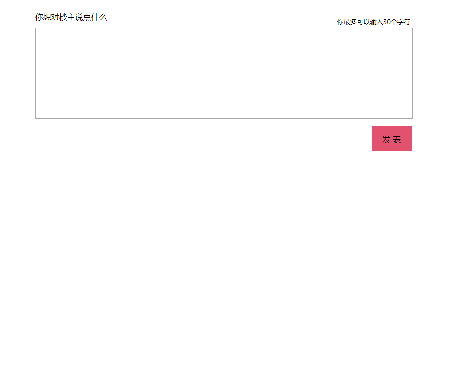

# 模拟微博评论

效果如下：
sdsadsd


HTML代码：
```
<!doctype html>
<html lang="en">
<head>
	<meta charset="UTF-8">
	<title>Document</title>
	<link rel="stylesheet" href="css/reset.css"/>
	<link rel="stylesheet" href="css/common.css"/>
</head>
<body id="body">
<div class="main">
	<span>你想对楼主说点什么</span>
	<span class="tag">你最多可以输入30个字符</span>
	<textarea id="text" cols="30" rows="10" maxlength="30" class="text"></textarea><br>
	<input type="button" value="发 表" id="ipt">
	<div id="txt" >
	</div>
</div>
</body>
</html>
<script src="js/xml.js"></script>
<script src="js/common.js"></script>
```
reset.css

```
html{font-family:"微软雅黑",Arial,sans-serif}
body,div,dl,dt,dd,ul,ol,li,h1,h2,h3,h4,h5,h6,form,fieldset,input,button,textarea,p,th,td,span{padding:0;margin:0;font-family:Microsoft YaHei,sans-serif,Arial}
table{border-collapse:collapse;border-spacing:0}
fieldset,img{border:0}
a{text-decoration:none;color:#000;outline:none}
li{list-style:none}
caption,th{text-align:left}
h1,h2,h3,h4,h5,h6{font-size:100%;font-weight:normal}
input,button,textarea,select,optgroup,option{font-family:inherit;font-size:inherit;font-style:inherit;font-weight:inherit}
input,button,textarea,select{*font-size:100%}
a{-webkit-transition:all 0.5s linear;-moz-transition:all 0.5s linear;-ms-transition:all 0.5s linear;-o-transition:all 0.5s linear}
.fix:after{content:'clear';clear:both;display:block;height:0;overflow:hidden;visibility:hidden;}
.fix{zoom:1;}
```

common.css

```
.main{
    width: 800px;
    margin:20px auto;
}
span{
    display: inline-block;
    width: 200px;
    height: 25px;
    line-height: 25px;
    vertical-align: center;
    text-align: left;
    margin-bottom: 10px;
}
.tag{
    font-size: 13px;
    margin-left: 370px;
    vertical-align: bottom;
    text-align: center;
    margin-bottom: 0;
}
.text{
    width: 750px;
    height: 180px;
    margin:0 auto;

    resize:none;
}

input{
    display: inline-block;
    width: 80px;
    height: 50px;
    background: #E2526F;
    border: 0;
    margin-left: 670px;
    margin-top: 10px;
}
.creatediv{
    width: 675px;
    height: 80px;
    border: 1px solid gray;
    position: relative;
    margin-top: 10px;
    padding-left: 75px;
}
.createinput{
    width: 80px;
    height: 30px;
    position:absolute;
    right: 5px;
    bottom:5px;
}
.createimg{
    width: 50px;
    height: 50px;
    position: absolute;
    top: 15px;
    left: 15px;
}
.createdivs{
    width:600px;
    height:50px;
    position: absolute;
    top: 15px;
    left: 85px;
}
```

xml.js

```
function get_previousSibling(n) {
	y=n.previousSibling;
	while (y.nodeType!=1) {
  		y=y.previousSibling;
  	}
	return y;
}
function get_nextSibling(n) {
	y=n.nextSibling;
	while (y.nodeType!=1) {
  		y=y.nextSibling;
  	}
	return y;
}
function get_lastChild(n) {
	y=n.lastChild;
	while (y.nodeType!=1) {
  		y=y.previousSibling;
  	}
	return y;
}
function get_firstChild(n) {
	y=n.firstChild;
	while (y.nodeType!=1) {
  		y=y.nextSibling;
  	}
	return y;
}

// Trim() , Ltrim() , RTrim()  
String.prototype.Trim = function(){   
return this.replace(/(^\s*)|(\s*$)/g, "");   
}   
String.prototype.LTrim = function(){   
return this.replace(/(^\s*)/g, "");   
}   
String.prototype.RTrim = function() {   
return this.replace(/(\s*$)/g, "");   
}  
```

common.js

```
var ipt = document.getElementById("ipt");
var txt = document.getElementById('txt');
var textarea = document.getElementById("text");
ipt.onclick = function(){
    var textValue = textarea.value.LTrim();
    textarea.value="";
    if(textValue.length>0 ){
        var divs = document.createElement("div");
        var imgs = document.createElement("img");
        var ps = document.createElement("p");
        var inputs = document.createElement("input");
        divs.setAttribute("class","creatediv");
        imgs.setAttribute('class',"createimg");
        ps.setAttribute("class","createdivs");
        inputs.setAttribute("class","createinput");
        imgs.src="pic/1.jpg";
        inputs.type="button";
        inputs.value="删除";
        ps.innerHTML=textValue;
        divs.appendChild(imgs);
        divs.appendChild(ps);
        divs.appendChild(inputs);
        if(txt.children.length==0){
            txt.appendChild(divs);

        }else{
            txt.insertBefore(divs,get_firstChild(txt))
        }
        inputs.onclick = function(){
            this.parentNode.parentNode.removeChild(this.parentNode)
        }
    }
}
```
